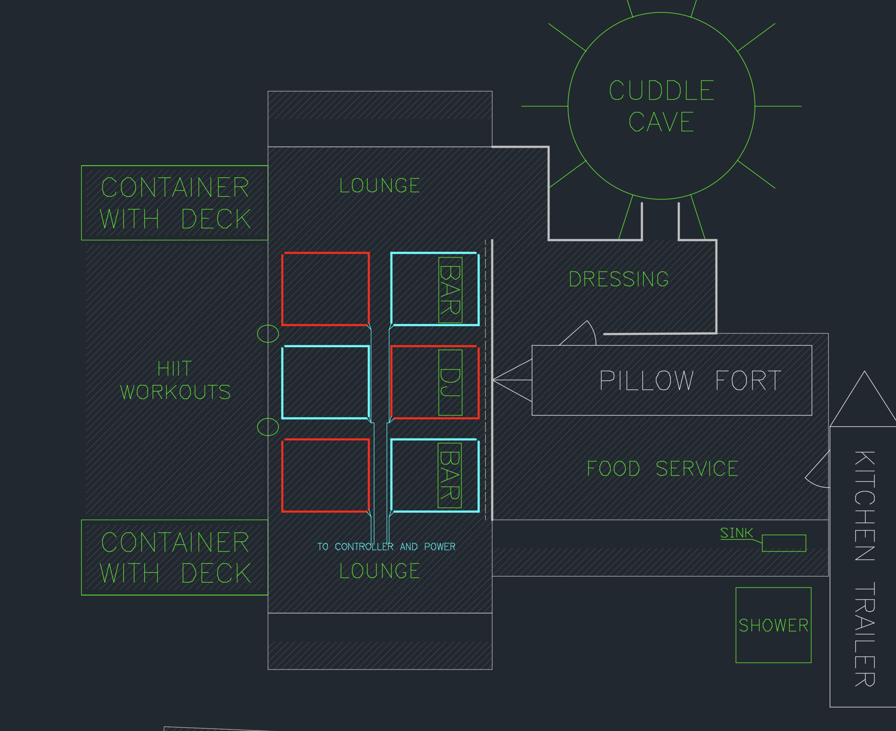

# spaceConsoleEmulator
VSCode emulator of Future Turtles ceiling lights 2023
# What is this?

An emulator that runs completely inside VS Code for the ceiling light system of the Future Turtles theme camp, 2023.

# The hardware that is being emulated

The camp ceiling lights are made up of 60 meters of flex-neon LED strips with 60 addressible pixels per meter (so, 3600 addressible pixels). Each pixel has three LEDS (R,G,B). The pixels are WS2815b.

There is a custom hardware controller based on an Arduino-type MCU (technically it is a Teensy 4.1). We use FastLED as the library for programming the LEDs. 

Because the hardware for the ceiling lights is all in storage, if you want to work on cool patterns, you need this emulator!

# What does flex neon look like?

You can see videos of this flex neon [here](https://www.blinkylights.blog/2022/05/23/single-cat-6-power-and-data-for-ws2815-led-strips/). It was previously used for a version of the camp antenna at the Renegade Burn in 2021; this year we are repurposing it to put nice lights in the ceiling. The color is very pastel and diffuse.
# How are the lights arranged?

The lights are arranged as six rectangles in the ceiling above the main interactive space in camp.

Here's a diagram of the layout of the public area
of the Future Turtles. In the main lounge there are
six rectangles show here in red and blue which represent
the locations of the camp ceiling lights.

In order to make it easy for the pattern programmer to design light shows without worrying about the hardware
layout of the LEDs, there are a bunch of functions in roof.h/.cpp which provide a simplified abstraction of the
pixel layout. For example, there is a simple function called SetRingColor which you can use to set the color of any single rectangle to the same color. There are other functions that give you more control, and you don't have to think about how the lights are arranged or connected.

# Scaling

Although the actual lights have 3600 pixels, the emulator only has 900, for performance reasons. The function SetRingPixel will set a single pixel in the emulator to a specific color; when run on the actual hardware, it will set four neighboring pixels to that color. You can also use the function SetRingPixelHD. This sets a single pixel in the actual hardware to a color (so it's higher resolution), but in the emulator, only every fourth pixel is actually displayed.

# How can I write my own patterns?

To create your own patterns, you will create your own personalized .h/.cpp files. You can use jetpack.h/.cpp as a template which has Jetpack's patterns in it. On playa, we will incorporate those files into the real code running on the controller.

# Speed

The emulator is ridiculously slow, and, sadly, there is no "real time clock" in the emulator. That means any animations you come up with will simply draw very, very slowly on the screen. When you get on the real hardware, you'll see them running in full speed. For example, suppose you have decided to run your animation at 120 bpm so it looks good with house music. So you write EVERY_N_MILLIS(500). On the simulator, depending on the speed of your CPU, this might run at 50 bpm. But when we run it on the real hardware, it will indeed look like 120bpm. (I've heard from the developer of Wokwi who is working on a fix!)

# Installation

1. Get VS Code
2. Install the latest platform.io
3. Install [wokwi for VS Code](https://docs.wokwi.com/vscode/getting-started)
4. Clone this repo and open it
5. In the VSCode terminal window, type "pio run" to compile
6. Press F1 and run Wokwi: Start Simulator to start the simulator
7. Send pull requests when your code is ready.

Try not to edit anything other than your own .cpp/.h files unless you're submitting a pull request for a bug fix. If you are confident you know what you are doing, you can submit pull requests to roof.h/roof.cpp but probably talk to me first.

If these instructions didn't work, figure out why (or ask me for help) and update this README.md file!
